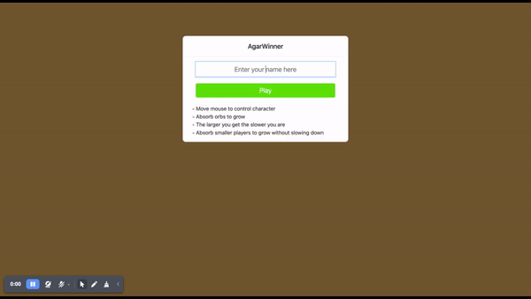

# Agar Winner

## Live Demo
[Agar Winner - Live](http://ks.perv.men:8090/)

## Demo

## Tech Stack 
- backend: functional scala with cats, fs2, http4s, munit
- front-end: vanilla js, canvas

## Instructions
  - Move mouse on the screen to move own character.
  - Absorb foods (orbs) by running over them in order to grow.
  - Absorb smaller players to get larger.

## Deployments 
```shell
git clone https://github.com/forhadmethun/agar-winner.git
cd agar-winner 
./deploy.sh
```

## Tasks List For Implementation
 - [x] Create scala project with cats, fs2, http4s
 - [x] Create ui directory that contains front-end related logic 
 - [x] Player enters their name in ui which load game board and connects to server via websocket
 - [x] Once player connected it gets list of foods from the server
 - [x] Server sends the player list to the client side with 30fps
 - [x] Player sends its direction vector to the server & server calculates the new location of the player
 - [x] Client side renders all the players & foods on the canvas
 - [x] Server calculates the collision with food or other player 
 - [x] Client side update the leader board, foods, players

## Future improvements
 - [ ] Update tests with [munit-cats-effect](https://github.com/typelevel/munit-cats-effect), [munit-scalacheck](https://scalameta.org/munit/docs/integrations/scalacheck.html)
 - [ ] ...